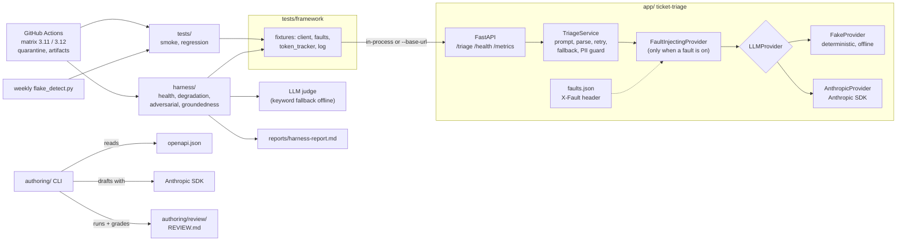

# quality-platform-kit

A working demonstration of shared quality infrastructure for a team that ships software
with an LLM inside it. One repository, five parts that fit together:

| Part | What it is | Where |
| --- | --- | --- |
| Target app | A FastAPI service that triages maintenance tickets with an LLM, with seven switchable faults | [`app/`](app/README.md) |
| Test framework | pytest fixtures, a typed client with retries and capture, fault toggling, token tracking, strict markers | [`tests/`](tests/README.md) |
| Resilience harness | Health probes, per-fault degradation contracts, YAML-driven adversarial payloads, an LLM-as-judge groundedness check, a token quota, a filled-in report | [`harness/`](harness/README.md) |
| CI | Lint, types, smoke, regression and harness on a Python matrix; a flaky-test quarantine that reports but never blocks; weekly flake detection that opens issues | [`.github/`](.github/workflows/ci.yml) |
| Test authoring | A CLI that drafts tests from an OpenAPI spec with a model, runs them, and grades them for weakness and duplication. Nothing is merged automatically | [`authoring/`](authoring/README.md) |

Everything runs offline by default, in about fifteen seconds, with a deterministic fake
provider. Add an API key and the same code runs against the real Anthropic API. The
harness caught three real bugs the first time it did.

## Architecture



## Quick start

Needs Python 3.11 or 3.12 and [uv](https://docs.astral.sh/uv/).

```bash
git clone https://github.com/StevenConboy/quality-platform-kit
cd quality-platform-kit
uv sync --all-groups
uv run pytest            # 124 tests, offline, about 15 seconds
uv run uvicorn app.main:app --port 8000   # then open http://localhost:8000/docs
```

A `Makefile` mirrors the common commands (`make test`, `make harness`, `make run`) for
those who have `make`; it is a convenience, not a requirement.

## Ten-minute demo

The full script with expected output for each step is in [DEMO.md](DEMO.md). The short
version, with the app running on port 8000:

**1. Triage a ticket (1 min).** The model reads it, assigns priority and category, and
writes a one-line summary.

```bash
curl -s localhost:8000/triage -H 'content-type: application/json' \
  -d '{"title":"Gas smell near boiler room","description":"Faint gas odour in the corridor outside the boiler room since 9am. Call Sam on 555-010-9999.","asset_id":"BOILER-B1"}'
```

**2. Break the LLM (2 min).** Add one header. The provider now times out; the app answers
anyway, from keyword rules and its category cache, and says so: `source: "fallback"`,
`degraded: true`, `degradation_reason: "llm_timeout"`.

```bash
curl -s localhost:8000/triage -H 'content-type: application/json' -H 'X-Fault: llm_timeout' -d '...'
```

Try `pii_leak` next: the provider echoes Sam's phone number and the app redacts it
before replying, with `warnings: ["pii_redacted"]`. Then `quota_exceeded`: a clean 503
with `Retry-After`, no LLM call made.

**3. Break it invisibly (1 min).** `X-Fault: llm_hallucinate` returns a confident, well
formed, wrong summary: "the asset is fully operational and no repair is required", for a
gas smell, with a 200 and no warning. The app cannot tell. Check `GET /triage/recent` to
see all four requests side by side, faults and outcomes together.

**4. Catch it (2 min).** Run the harness. It injects every fault, compares the app's
behaviour with the written contract, throws thirty hostile payloads at it, and checks
every summary against its ticket.

```bash
uv run pytest harness
```

Open `reports/harness-report.md`. The degradation table shows contract versus observed
per fault. The groundedness section shows "Injected hallucinations caught: 1 of 1". The
token spend section shows what the run cost.

**5. Find flaky tests (2 min).** Run a suite five times and compare. With the
simulation switch on, the demo test fails on a coin flip; the detector reports it and
`--apply` quarantines it with a dated marker. In CI, quarantined tests run in a separate
step that cannot block a merge.

```bash
SIMULATE_FLAKY=1 uv run python scripts/flake_detect.py --suite tests/demo --runs 6
```

**6. Draft tests with a model (2 min).** Point the authoring tool at the spec. It drafts
tests in the framework's own style, runs them, and writes a review: passed, failed, no
assertions, trivial assertions, duplicates of existing tests. Without a key, `--draft`
reviews a hand-written file that has all of those problems on purpose.

```bash
uv run authoring export-spec --out openapi.json
uv run authoring generate --spec openapi.json --endpoint /triage --draft authoring/examples/triage_draft.py
```

Then show the CI page: matrix jobs, the quarantine summary, the uploaded harness report,
and the online harness job that runs against the real API on request.

## Decisions and trade-offs

**Faults live in the app, behind a switch.** A test that wants a 429 does not mock the
SDK; it sends a header. The fault injector wraps the provider only when a fault is on,
so the production path has no test hooks in it. The cost is that the app carries a small
amount of test-only code and an admin endpoint, both clearly labelled.

**The app degrades on LLM faults and fails loudly on its own guardrails.** Timeouts,
rate limits and garbage become a fallback answer with `degraded: true`, because a
half-answer beats no answer for a maintenance ticket. A spent token budget is a 503,
because silently serving fallbacks would hide it until the bill arrived.

**Hallucination is deliberately not handled in the app.** The app returns it with a 200.
A test in `tests/` pins that limitation. The harness's groundedness check is the answer,
and it is a separate check because judging faithfulness needs either a model or a
heuristic, neither of which belongs in a request path that has to be fast and cheap.

**A fake provider that estimates tokens.** Everything about budgets, quotas and spend
reports works offline with plausible numbers, so the whole story can be rehearsed
without a key. The trade-off is that the fake is a keyword heuristic, so tests assert on
structure and documented values, never on the fake's exact wording.

**Tests run in-process by default.** FastAPI's test client calls the app directly: no
port, no server, no flakiness from networking, and five seconds for the shared suite.
The same tests run against a live server with `--base-url` when that is the question.

**Contracts are data.** Each fault's expected behaviour is a row in
`harness/test_degradation.py`, adversarial payloads are YAML, the judge's rubric is a
Markdown file, and the harness budget is a config file. Adding to any of them does not
mean writing Python.

**The LLM judge falls back to keywords, and says so.** Offline runs still catch the
injected hallucination. The report names which method produced each verdict, so a green
offline run is never mistaken for a green judged run.

**SDK retries are on; the app's own retry is one attempt on malformed output.** The first
real-API run showed that runner-to-API connection blips reach the app as fallbacks
otherwise. Faults are injected above the SDK, so retries do not weaken the fault tests.

**Quarantine is a second pytest run, not a plugin.** `-m "not flaky"` decides the job;
`-m flaky` runs afterwards with `continue-on-error` and its results go to the job
summary. It is two lines of YAML per job and needs nothing installed.

**The online harness is opt-in.** It passed on the real API, and each run costs around
40k tokens, so it runs only on a manual dispatch with `run_online=true`. The offline
harness runs on every push.

**Duplicate detection in the authoring tool is exact match.** Two drafts are duplicates
only when they make the same calls and assert the same fields, operators, literals and
parameters. Overlapping-but-different coverage is left to the reviewer, with the
fingerprints printed to help. Fewer false positives beat a smarter heuristic that argues.

**The authoring tool lives in this repo.** It depends on the framework's conventions and
reads the app's spec, so one clone gives the whole demo. It imports nothing from the app
except the fault-name list and has its own console script; lifting it out is a copy and
a `--spec` URL.

**Plain code over clever.** Dataclasses, argparse, `ast`, one small JSON logger. No
plugin frameworks, no metaclasses, nothing a new team member would need to look up.

## What the real API run found

The first time the harness ran against the real model, three things surfaced, each fixed
with a regression test: the fallback summary skipped the PII guard, so an email in a
ticket title leaked whenever the LLM was down; the model decoded asset codes into
locations ("north stairwell, level 3" from `STAIR-N-3`), which the judge scored as
unsupported; and dropped connections were reaching the app as fallbacks with SDK retries
off. Details in the [harness README](harness/README.md#what-the-first-online-run-found).

## Layout

```
app/          the target service and its fault injection layer
tests/        shared framework (tests/framework) plus smoke, regression and demo suites
harness/      resilience suites, groundedness judge, quota, report template
authoring/    the test-drafting CLI and its review logic
scripts/      flake_detect.py, junit_summary.py
.github/      CI and the weekly flake-detection workflow
DEMO.md       the step-by-step demo script
```

## Configuration

Copy `.env.example` to `.env`. `TRIAGE_PROVIDER=anthropic` plus `ANTHROPIC_API_KEY`
switches the app to the real model; the same key enables the LLM judge and the authoring
tool. Every other setting has a sensible default.
